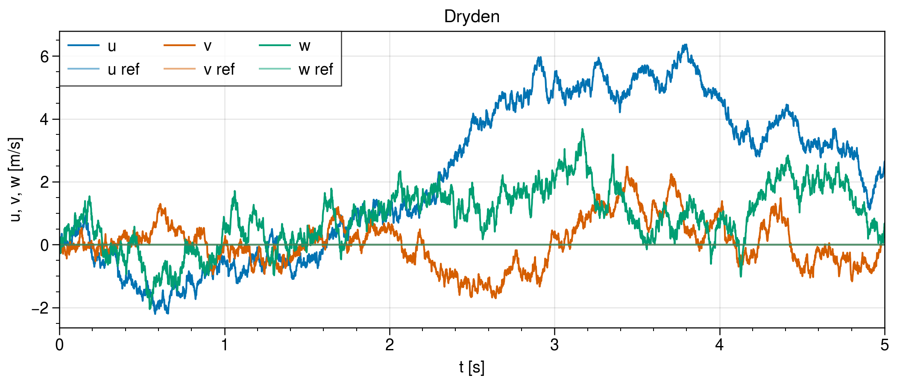
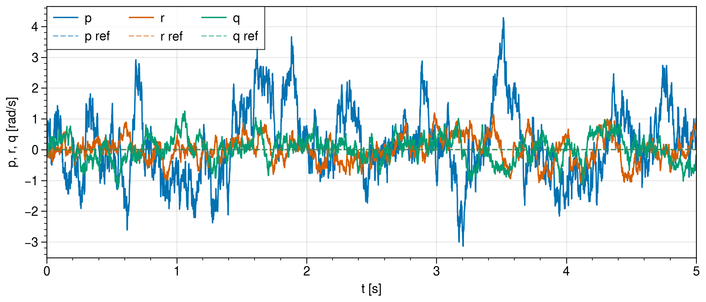
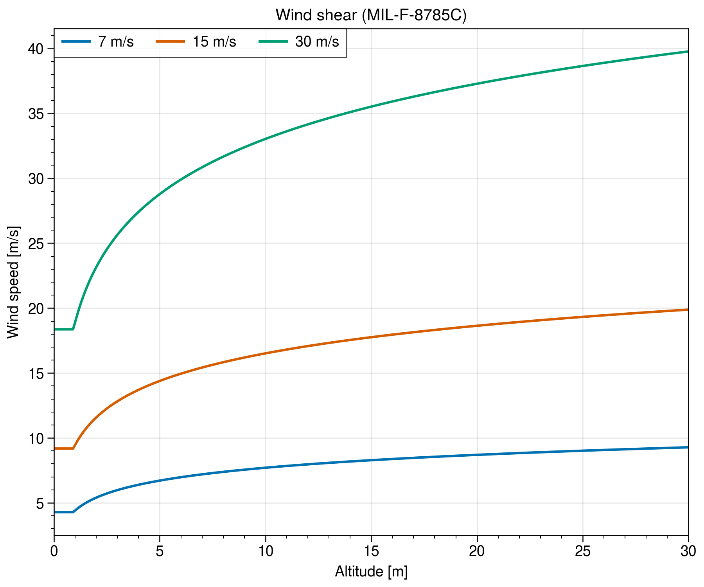

# AtmosphereTools.jl

Different tools for the atmosphere and wind to model the following:
- wind disturbances
- wind shear

## Wind Turbulence Model

- Implementation of the simplified Dryden wind turbulence model "MIL STD model" in [1].
- **Warning:** Only implemented for low altitude

### ToDo

- [ ] Implement medium and high altitudes (see [2])

### Validation with MATLAB

</img>

</img>

## Wind Shear Model

- Low-altitude wind shear model according to [2]

</img>

## References

1. J. Yeager, “Implementation and Testing of Turbulence Models for the F18-HARV Simulation,” NASA, Hampton, VA, NASA Contractor Report 206937, 1998.
2. D. Moorhouse and R. Woodcock, “MIL-F-878SC. United States Military Specification: Flying Qualities of Piloted Airplanes,” US Department of Defense, Washington, DC, USA, 1980.

## License 

This code is licensed under MIT.